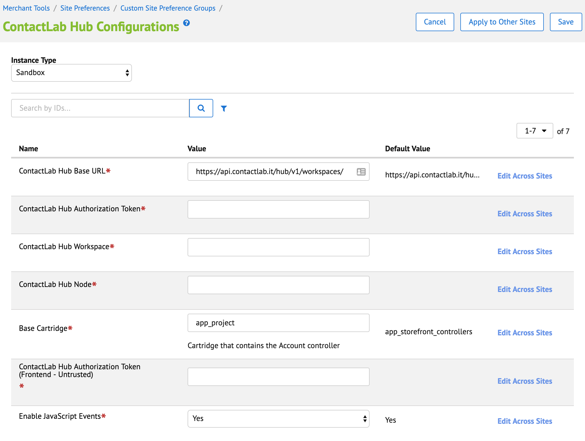
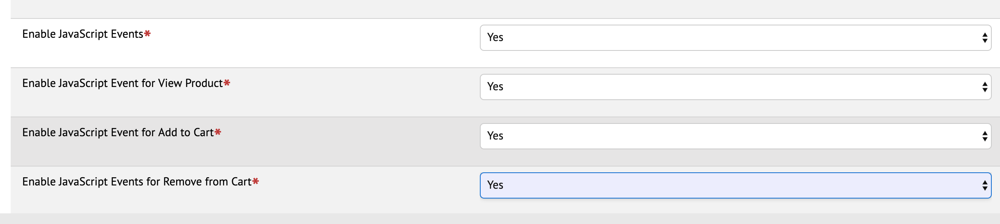
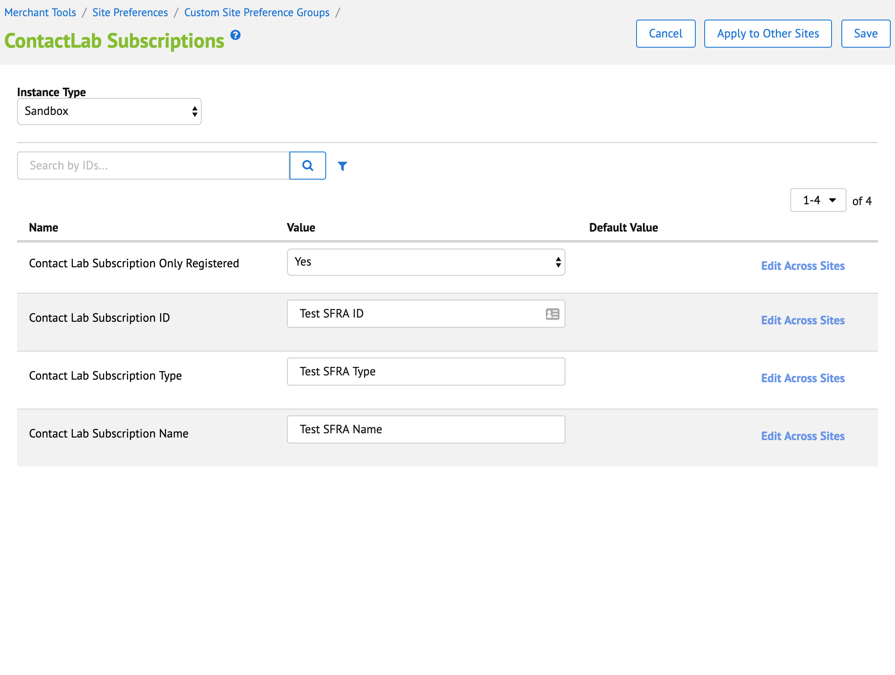
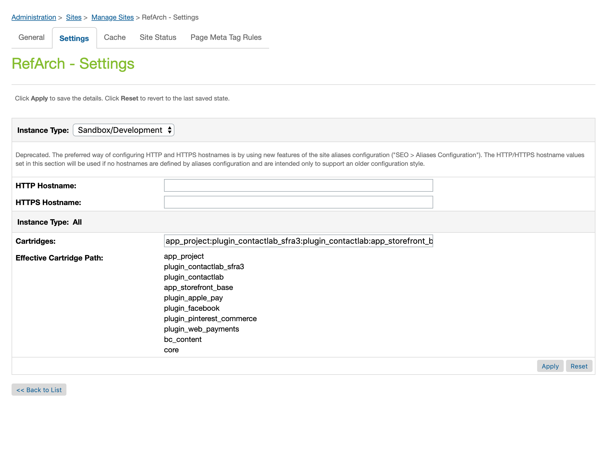

## Get Started
Before begin to integrate B2C Commerce with Contact Hub platform, make sure that you have permed following steps:
1. Install Cartridge Metadata
1. Configure Site Properties
1. Update Storefront templates
1. Configure Site Cartridge Path

### Install Cartridge Metadata
Check the folder `metadata/site_import/meta`, it contains a file named `system-objecttype-extensions.xml` that contains system object customization used for cartridge.

Connect to your _Business Manager_ and select, from **Administration** the **Import & Export** page under **Site Development** section. Then Upload the given file and Import it.

* _Profile_: added fields for handle the Contact Hub Identificator and a date for last sync
* _Site Preferences_: basically divided in two sections:
  1. _Configuration_: Connection parameters, Token and so on
  1. _Subscription_: Data for newsletter subscription

### Configure Site Properties
#### ContactLab Hub Configurations
Under Site Preferences you can configure te ContactLab access, as showed:

The fields:
* ContactLab Base URL
* ContactLab Base authorization token
* ContactLab Workspace
* ContactLab Hub Node
* Base Cartridge: base cartridge of your project
* ContactLab Hub Authorization Token: javascript token, used for cart events

Regarding Javascript client events

Fields:
* Enable Javascript Events: enable or disable All events.
* Enable JS events for View Product: Enable sending event when user browse a PDP (require that main flag _Enable Javascript Events_ is enable).
* Enable JS events for Add to Cart: Enable sending event when user add a product to cart (require that main flag _Enable Javascript Events_ is enable).
* Enable JS events for Remove from Cart: Enable sending event when user remove a product from cart (require that main flag _Enable Javascript Events_ is enable).

#### ContactLab Subscriptions
Following image explain


### Update Storefront Templates
If you are using a SFRA version 3.5 or above no code changes are need.

If yout SFRA is earlier than 3.5, to make it work the newsletter field in the footer you need to add following javascript: `patch_sfra3.3.js` to the provided template `pageFooter.isml`.

Then, edit (or overload in your project) the provided file `pageFooter.isml` (in the *plugin_contactlab_sfra3* cartridge) and check for following code:

```xml
<isif condition="${'EnableJs' in dw.system.Site.current.preferences.custom && dw.system.Site.current.preferences.custom.EnableJs}">
  <script defer type="text/javascript" src="${URLUtils.staticURL('/js/contacthub.js')}"></script>
  <isinclude template="contacthub/contacthub" />
</isif>
```
change it adding javascript inclusion:

```xml
<isif condition="${'EnableJs' in dw.system.Site.current.preferences.custom && dw.system.Site.current.preferences.custom.EnableJs}">
  <script defer type="text/javascript" src="${URLUtils.staticURL('/js/contacthub.js')}"></script>
  <script defer type="text/javascript" src="${URLUtils.staticURL('/js/patch_sfra3.3.js')}"></script>
  <isinclude template="contacthub/contacthub" />
</isif>

```

### Configure Cartridge Path
In the sesction **Administration->Manage Sites** add the contactlab cartridges to the `cartridge path`:
* plugin_contactlab_sfra3
* plugin_contactlab


### Test and Go Live
### Customization
#### Hooks
For customize the customer object (e.g. for set some custom attributes), cartridge ```plugin_contactlab``` provide some postprocess hook called before send customer information to ContactHub.
The hooks are:
* plugin_contactlab.customer.send: used on new customer registration. the script must export a function named ```postprocess``` with a postCustomer parameter, and must return the modified postCustomer.
* plugin_contactlab.customer.sync: user on customer update. the script must export a function named ```postprocess``` with a postCustomer parameter, and must return the modified postCustomer.
For ```postCustomer``` object structure please take a look to http://developer.contactlab.com/hub-swagger/#operation/postCustomerWorkspaces

For example:
```js
exports.postprocess = function(postCustomer) {

  postCustomer.extended = {};
  postCustomer.extended.LANGUAGE = 'IT';

  return postCustomer;
}
```

#### Code overloading
If you want to change the newsletter consents or subscription information you can override the `NewsletterUtils.js`.
Please note that in the consent section, the JSON is the same described in the Contact Lab API.

